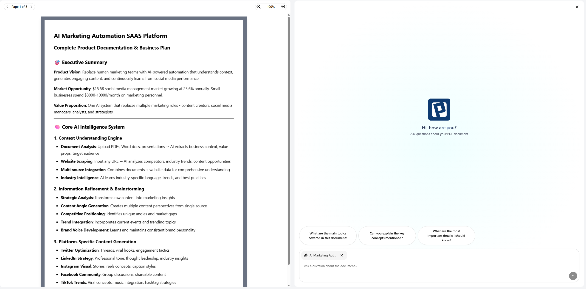
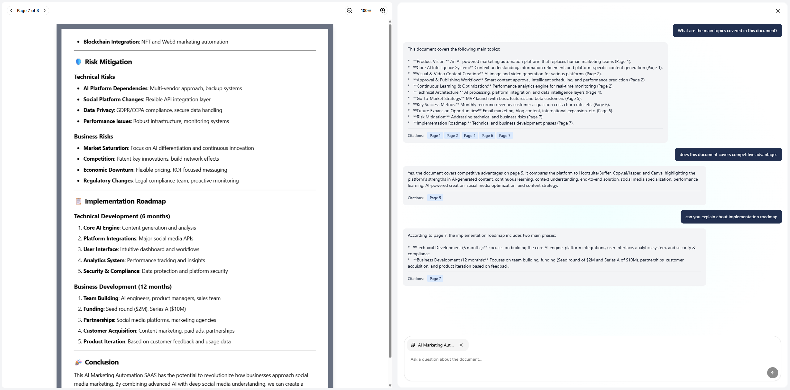

I'll help you create a comprehensive README.md file for your project that includes the images. Here's the content you can use:

```markdown
# AI-Powered Document Assistant

A modern web application that allows users to upload PDF documents and interact with them using AI-powered chat.

## Features

- Upload and view PDF documents
- Chat with AI about document content
- Smart search and context-aware responses
- Responsive design for all devices
- Clean and intuitive user interface

## Screenshots

### Chat Interface


### Chat History


## Tech Stack

- **Frontend**: React, TypeScript, Redux Toolkit, Tailwind CSS
- **Backend**: Node.js, Express
- **AI**: Google Gemini AI
- **State Management**: Redux Toolkit
- **Styling**: Tailwind CSS, Shadcn UI components

## Getting Started

### Prerequisites

- Node.js (v16 or higher)
- npm or yarn
- Google Gemini API key

### Installation

1. Clone the repository:
   ```bash
   git clone https://github.com/your-username/playpower.git
   cd playpower
   ```

2. Install backend dependencies:
   ```bash
   cd backend
   npm install
   ```

3. Install frontend dependencies:
   ```bash
   cd ../frontend
   npm install
   ```

4. Set up environment variables:
   - Create [.env](cci:7://file:///c:/Users/admin/Desktop/Interview%20Preparation%20Resources/frontend/assessment/playpower/frontend/.env:0:0-0:0) in the backend directory:
     ```
     PORT=5000
     GEMINI_API_KEY=your_gemini_api_key
     ```
   - Create [.env](cci:7://file:///c:/Users/admin/Desktop/Interview%20Preparation%20Resources/frontend/assessment/playpower/frontend/.env:0:0-0:0) in the frontend directory:
     ```
     VITE_API_BASE_URL=http://localhost:5000/api
     ```

5. Start the backend server:
   ```bash
   cd ../backend
   npm start
   ```

6. Start the frontend development server:
   ```bash
   cd ../frontend
   npm run dev
   ```

7. Open [http://localhost:5173](http://localhost:5173) in your browser.

## Project Structure

```
playpower/
├── backend/               # Backend server
│   ├── src/
│   │   ├── config/       # Configuration files
│   │   ├── controllers/  # Route controllers
│   │   ├── middleware/   # Express middleware
│   │   ├── models/       # Data models
│   │   ├── routes/       # API routes
│   │   └── services/     # Business logic
│   └── package.json
│
├── frontend/             # Frontend React app
│   ├── public/           # Static files
│   └── src/
│       ├── app/          # API and store configuration
│       ├── features/     # Feature-based modules
│       ├── shared/       # Shared components and utilities
│       └── main.tsx      # Application entry point
│
└── README.md             # This file
```

## Available Scripts

### Backend
- `npm start` - Start the production server
- `npm run dev` - Start the development server with hot-reload

### Frontend
- `npm run dev` - Start the development server
- `npm run build` - Build for production
- `npm run preview` - Preview production build

## Environment Variables

### Backend
| Variable | Description |
|----------|-------------|
| `PORT` | Port to run the server on |
| `GEMINI_API_KEY` | Google Gemini API key |

### Frontend
| Variable | Description |
|----------|-------------|
| `VITE_API_BASE_URL` | Base URL for the backend API |

## Contributing

1. Fork the repository
2. Create your feature branch (`git checkout -b feature/AmazingFeature`)
3. Commit your changes (`git commit -m 'Add some AmazingFeature'`)
4. Push to the branch (`git push origin feature/AmazingFeature`)
5. Open a Pull Request


```
